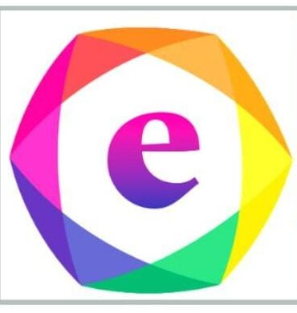

# 🏥 Elite Drug - Enhancing Health

<div align="center">
  
  
  **Your Health, Our Priority - Delivering Quality Medicines Since 2016**

  [](https://nextjs.org/)
  [](https://www.typescriptlang.org/)
  [](https://tailwindcss.com/)
  [](https://supabase.com/)
</div>

---

## 📋 Table of Contents

- [Overview](#-overview)
- [Features](#-features)
- [Tech Stack](#-tech-stack)
- [Getting Started](#-getting-started)
- [Environment Variables](#-environment-variables)
- [Database Setup](#-database-setup)
- [Project Structure](#-project-structure)
- [Key Features](#-key-features-in-detail)
- [Admin Panel](#-admin-panel)
- [API Documentation](#-api-documentation)
- [Deployment](#-deployment)
- [Contributing](#-contributing)
- [License](#-license)

---

## 🌟 Overview

Elite Drug is a modern, full-stack pharmaceutical e-commerce platform built with Next.js 14+ and Supabase. It offers a comprehensive solution for online medicine sales with AI-powered product analysis, real-time announcements, and a powerful admin dashboard.

### 🎯 Key Highlights

- **AI-Powered Analysis**: Perplexity AI integration for detailed medicine composition analysis
- **Modern UI/UX**: Responsive design with dark mode support
- **Real-time Updates**: Live announcements and product updates
- **SEO Optimized**: Open Graph meta tags for social media sharing
- **Secure Admin Panel**: Encrypted authentication with bcrypt
- **Image Management**: Cloudinary CDN integration
- **Type-Safe**: Full TypeScript implementation

---

## ✨ Features

### 🛍️ Customer Features
- ✅ Browse 73+ pharmaceutical products across 13 categories
- ✅ Advanced search and filtering by category, composition, name
- ✅ Product quick view modal with detailed information
- ✅ AI-generated medicine composition analysis
- ✅ Dark/Light theme toggle
- ✅ Recently viewed products tracking
- ✅ Prescription (Rx) product indicators
- ✅ Social media sharing with product images (Open Graph)
- ✅ Responsive mobile-first design
- ✅ Smooth animations with Framer Motion
- ✅ Hero slideshow with auto-rotation
- ✅ Real-time announcement bar

### 🔧 Admin Features
- ✅ Secure login with encrypted passwords
- ✅ Complete product CRUD operations
- ✅ Multi-image upload to Cloudinary
- ✅ AI-powered composition analysis
- ✅ Announcement management system
- ✅ Product categorization
- ✅ Real-time data synchronization
- ✅ Searchable product selector
- ✅ Instant cache revalidation

### 🎨 UI/UX Features
- ✅ Modern gradient designs
- ✅ Loading animations with logo
- ✅ Smooth page transitions
- ✅ Interactive product carousels
- ✅ Breadcrumb navigation
- ✅ Scroll to top button
- ✅ Category-specific landing pages
- ✅ More Products carousel with animations

---

## 🛠️ Tech Stack

### Frontend
- **Framework**: Next.js 16.1.1 (App Router)
- **Language**: TypeScript 5.0+
- **Styling**: Tailwind CSS 3.4
- **Animations**: Framer Motion
- **Icons**: Lucide React
- **Image Optimization**: Next/Image with Cloudinary CDN

### Backend
- **Database**: Supabase (PostgreSQL)
- **Authentication**: JWT + bcryptjs
- **AI Integration**: Perplexity AI API (sonar-pro model)
- **File Storage**: Cloudinary
- **API Routes**: Next.js API Routes

### Development Tools
- **Package Manager**: npm
- **Code Quality**: ESLint, TypeScript
- **Version Control**: Git
- **Environment**: Node.js 18+

---

## 🚀 Getting Started

### Prerequisites

```bash
Node.js >= 18.0.0
npm >= 9.0.0
Git
```

### Installation

1. **Clone the repository**
```bash
git clone https://github.com/yourusername/elite-drug.git
cd elite-drug
```

2. **Install dependencies**
```bash
npm install
```

3. **Set up environment variables**
```bash
# Copy the example env file
cp .env.example .env.local
# Edit .env.local with your credentials
```

4. **Set up Supabase database**
```bash
# Run the migration files in the supabase/migrations folder
# Through Supabase Dashboard > SQL Editor
```

5. **Run the development server**
```bash
npm run dev
```

6. **Open your browser**
```
http://localhost:3000
```

---

## 🔐 Environment Variables

Create a `.env.local` file in the root directory:

```env
# Supabase Configuration
NEXT_PUBLIC_SUPABASE_URL=your_supabase_project_url
NEXT_PUBLIC_SUPABASE_ANON_KEY=your_supabase_anon_key
SUPABASE_SERVICE_ROLE_KEY=your_supabase_service_role_key

# Cloudinary Configuration
NEXT_PUBLIC_CLOUDINARY_CLOUD_NAME=your_cloud_name
NEXT_PUBLIC_CLOUDINARY_API_KEY=your_api_key
CLOUDINARY_API_SECRET=your_api_secret

# Perplexity AI Configuration
PERPLEXITY_API_KEY=your_perplexity_api_key

# JWT Secret
JWT_SECRET=your_secure_jwt_secret_key

# Base URL (for production)
NEXT_PUBLIC_BASE_URL=https://yourdomain.com
```

### How to Get API Keys

**Supabase:**
1. Sign up at [supabase.com](https://supabase.com)
2. Create a new project
3. Get keys from Settings > API

**Cloudinary:**
1. Sign up at [cloudinary.com](https://cloudinary.com)
2. Get credentials from Dashboard

**Perplexity AI:**
1. Sign up at [perplexity.ai](https://www.perplexity.ai)
2. Get API key from settings

---

## 💾 Database Setup

### 1. Create Supabase Project

1. Go to [supabase.com](https://supabase.com) and create a new project
2. Wait for the project to be provisioned

### 2. Run Migrations

Navigate to **SQL Editor** in Supabase Dashboard and run these migrations:

#### Products Table
```sql
-- Run: supabase/migrations/20260125_create_products.sql
```

#### Announcements Table
```sql
-- Run: supabase/migrations/20260125_create_announcements.sql
```

### 3. Enable Row Level Security (RLS)

RLS policies are included in the migration files:
- **Products**: Public read access, authenticated write
- **Announcements**: Public read for active, admin full access

### 4. Sample Data (Optional)

You can add sample products through the Admin Panel after setup.

---

## 📁 Project Structure

```
Elite/
├── public/
│   ├── images/
│   │   ├── hero/          # Hero slideshow images
│   │   │   ├── slide1.jpg
│   │   │   ├── slide2.jpg
│   │   │   └── slide3.jpg
│   │   └── placeholder.svg
│   └── logo.png
├── src/
│   ├── app/
│   │   ├── admin/         # Admin panel routes
│   │   │   ├── dashboard/ # Admin dashboard
│   │   │   └── page.tsx   # Admin login
│   │   ├── api/           # API routes
│   │   │   ├── admin/     # Admin APIs
│   │   │   │   ├── analyze-composition/
│   │   │   │   ├── announcements/
│   │   │   │   └── login/
│   │   │   ├── announcements/
│   │   │   └── products/
│   │   ├── categories/    # Category pages
│   │   │   └── [id]/
│   │   ├── products/      # Product pages
│   │   │   └── [slug]/
│   │   ├── announcements/ # Announcements page
│   │   ├── layout.tsx     # Root layout
│   │   └── page.tsx       # Home page
│   ├── components/
│   │   ├── Header.tsx
│   │   ├── Footer.tsx
│   │   ├── HeroSlideshow.tsx
│   │   ├── CategorySection.tsx
│   │   ├── ProductsSection.tsx
│   │   ├── MoreProductsCarousel.tsx
│   │   ├── AnnouncementBar.tsx
│   │   ├── QuickViewModal.tsx
│   │   ├── RecentlyViewed.tsx
│   │   ├── ScrollToTop.tsx
│   │   └── Breadcrumbs.tsx
│   ├── contexts/
│   │   └── ThemeContext.tsx
│   ├── lib/
│   │   └── supabase/
│   │       └── server.ts  # Supabase clients
│   └── types/
│       └── index.ts       # TypeScript types
├── supabase/
│   └── migrations/        # Database migrations
├── .env.local            # Environment variables
├── next.config.js        # Next.js configuration
├── tailwind.config.ts    # Tailwind configuration
├── tsconfig.json         # TypeScript configuration
└── package.json          # Dependencies
```

---

## 🎯 Key Features in Detail

### 🤖 AI-Powered Medicine Analysis

Uses Perplexity AI (sonar-pro model) to generate comprehensive medicine information:

- **Composition Analysis**: Detailed breakdown of active ingredients
- **Usage Instructions**: Proper dosage and administration
- **Side Effects**: Comprehensive list with severity indicators
- **Precautions**: Important warnings and contraindications
- **Benefits**: Health advantages and therapeutic effects
- **Mechanism**: How the medicine works in the body

**Implementation**: `src/app/api/admin/analyze-composition/route.ts`

### 📢 Real-Time Announcements

Dynamic announcement system with:
- Multiple announcement types (info, success, warning, error, sale, new_product, update)
- Auto-rotation every 5 seconds
- Priority-based sorting
- Expiration dates
- Session-based dismissal
- Product link integration

**Components**: 
- `src/components/AnnouncementBar.tsx`
- `src/app/api/admin/announcements/route.ts`

### 🖼️ Image Management

Cloudinary integration for:
- Multi-image upload
- Automatic optimization
- CDN delivery
- Gallery management
- Fallback placeholders

**Path**: `src/app/admin/dashboard/add-product/page.tsx`

### 🔍 Category System

13 medical categories:
- Diabetes Care
- Heart Care
- Stomach Care
- Liver Care
- Bone & Joint Health
- Kidney Care
- Derma Care
- Respiratory Care
- Pain Management
- Women's Health
- Vitamins & Supplements
- Neuropathy
- Antibiotics

**Implementation**: `src/app/categories/[id]/page.tsx`

### 🎨 Theme System

Context-based dark/light mode:
- System preference detection
- LocalStorage persistence
- Smooth transitions
- Component-level theming

**Context**: `src/contexts/ThemeContext.tsx`

### 📱 Social Media Sharing

Open Graph and Twitter Card meta tags for rich previews:
- Product images
- Titles and descriptions
- Dynamic URL generation
- Platform-specific optimization

**Implementation**: `src/app/products/[slug]/page.tsx`

---

## 👨‍💼 Admin Panel


### Admin Features

#### 1. Dashboard (`/admin/dashboard`)
- Overview statistics
- Quick actions
- Recent activity

#### 2. Product Management (`/admin/dashboard/add-product`)
- Add new products
- AI composition analysis
- Multi-image upload
- Category assignment
- Pricing and inventory

#### 3. Announcements (`/admin/dashboard/announcements`)
- Create announcements
- Link to products
- Set priority and expiration
- Manage active/inactive status

### Security Features
- Bcrypt password encryption
- JWT authentication
- Service role key for admin operations
- Row Level Security (RLS) bypass for admin

---

## 📡 API Documentation

### Public APIs

#### Get All Products
```http
GET /api/products
```
**Response**: Array of product objects with normalized image format

#### Get Active Announcements
```http
GET /api/announcements
```
**Response**: Array of active, non-expired announcements

### Admin APIs (Requires Authentication)

#### Analyze Composition
```http
POST /api/admin/analyze-composition
Content-Type: application/json

{
  "composition": "Atorvastatin 10mg + Clopidogrel 75mg"
}
```

#### Create Product
```http
POST /api/products
Content-Type: application/json

{
  "name": "Product Name",
  "price": 299,
  "mrp": 399,
  "category": "Heart Care",
  "composition": "Active ingredients",
  "images": {
    "main": "cloudinary_url",
    "gallery": ["url1", "url2"]
  }
  // ... other fields
}
```

#### Manage Announcements
```http
POST /api/admin/announcements
PATCH /api/admin/announcements
DELETE /api/admin/announcements
```

---

## 🚀 Deployment

### Vercel (Recommended)

1. **Push to GitHub**
```bash
git push origin main
```

2. **Import to Vercel**
- Go to [vercel.com](https://vercel.com)
- Import your repository
- Add environment variables
- Deploy

3. **Environment Variables**
Add all variables from `.env.local` to Vercel project settings

4. **Domain Setup**
- Add custom domain in Vercel
- Update `NEXT_PUBLIC_BASE_URL` in environment variables

### Alternative Platforms

- **Netlify**: Similar process to Vercel
- **AWS Amplify**: For AWS infrastructure
- **Railway**: For quick deployments
- **Self-hosted**: Use `npm run build` and `npm start`

---

## 🔧 Scripts

```json
{
  "dev": "next dev",           // Development server
  "build": "next build",       // Production build
  "start": "next start",       // Production server
  "lint": "next lint"          // Run ESLint
}
```

---

## 🤝 Contributing

Contributions are welcome! Please follow these steps:

1. **Fork the repository**
2. **Create a feature branch**
   ```bash
   git checkout -b feature/amazing-feature
   ```
3. **Commit your changes**
   ```bash
   git commit -m 'Add amazing feature'
   ```
4. **Push to the branch**
   ```bash
   git push origin feature/amazing-feature
   ```
5. **Open a Pull Request**

### Coding Standards

- Use TypeScript for type safety
- Follow ESLint rules
- Write meaningful commit messages
- Add comments for complex logic
- Test before submitting PR

---

## 📝 License

This project is licensed under the MIT License - see the [LICENSE](LICENSE) file for details.

---

## 👥 Team

**Elite Drug Development Team**
- Full-stack development
- UI/UX design
- Database architecture
- AI integration

---

## 📧 Contact

- **Website**: [https://elitedrug.com](https://elitedrug.com)
- **Email**: admin@elitedrug.com
- **Support**: Contact through website

---

## 🙏 Acknowledgments

- [Next.js](https://nextjs.org/) - React framework
- [Supabase](https://supabase.com/) - Backend platform
- [Tailwind CSS](https://tailwindcss.com/) - CSS framework
- [Framer Motion](https://www.framer.com/motion/) - Animation library
- [Cloudinary](https://cloudinary.com/) - Image management
- [Perplexity AI](https://www.perplexity.ai/) - AI analysis
- [Lucide Icons](https://lucide.dev/) - Icon library

---

## 📊 Stats

- **Products**: 73+
- **Categories**: 13
- **API Routes**: 15+
- **Components**: 20+
- **TypeScript Coverage**: 100%

---

<div align="center">
  Made with ❤️ by Elite Drug Team
  
  **⭐ Star us on GitHub if you find this helpful!**
</div>

